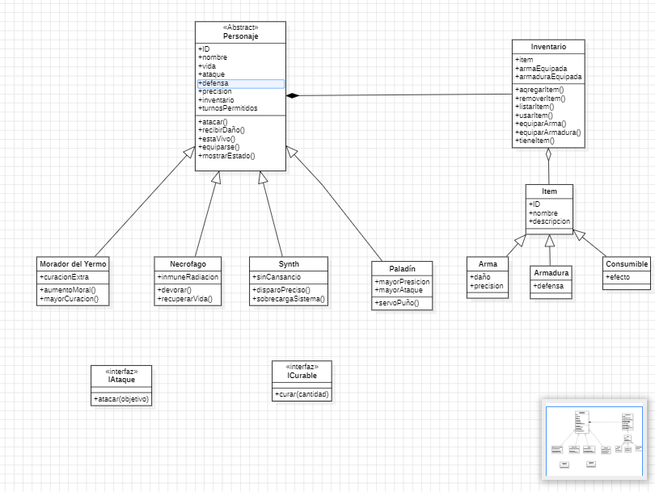

# 🔐 FakeOut 

FakeOut es un videojuego rpg desarrollado en consola utilizando Node.JS junto a librerias.

## 📌 Descripción del Proyecto

El objetivo principal de este proyecto es crear una experiencia de juego agradable para el usuario utilizano la consola de Node.JS.
Este proyecto implementa las siguientes opciones:

- Creacion de personajes.
  
- Seleccion de personajes.

- Batallas contra enemigos.

- Batallas entre dos jugadores.

## 🛠️ Librerías Utilizadas

- uuid
 → Para generar id's unicos para nuestros personajes.

- chalk
 → para mostrar mensajes coloridos en consola.

- sleep
 → para una experiencia mas comoda respecto a la aparicion de mensajes.

- fs (File System)
 → para leer y escribir en el archivo accounts.json.

- inquirer
 → para manejar entradas del usuario por consola.

## ⚙️ Implementación

**1.** El sistema arranca mostrando un menú principal:

-  1 Jugador

-  2 Jugadores

-  Salir

**2.** En ambas opciones de juego:

- Se solicita crear o elegir uno de los jugadores existentes para uno o mas jugadores (depende del modo de juego).

- El jugador selecciona un preset (conjunto de items inicial) para su personaje, tambien puede optar por no tomarlo y mantener su inventario actual (cuando se toma un preset el inventario se reinicia).

- Inicia la batalla contra:
  - Enemigo aleatorio (1 jugador)  
  - Jugador 2 (2 jugadores)  

**3.** En exit:

- El flujo de termina y cierra el archivo.

---
## 📂 Estructura del Proyecto
````
Fakeout/
├── data/
│   └── personajes.json            # Archivo con los personajes creados
├── models/                        # Carpeta donde se encuentran los modelos de clase
│   └── Morador.js     
│   └── Necrofago.js    
│   └── Paladin.js   
│   └── Personaje.js               # Clase abstracta de personajes
│   └── Synth.js
├── services/                      # Carpeta donde se encuentran la logica del proyecto.
│   └── EnemigoAleatorio.js        # Clase que selecciona un enemigo aletorio del JSON.
│   └── FabricaPersonajes.js       # Patron de diseño factory.
│   └── GenerarLoot.js             # Genera un item aleatorio y lo retorna.
│   └── index.js                   # Logica principal del proyecto.
│   └── InventarioInteractivo.js   # Clase con metodos que permiten la manipulacion del inventario.
│   └── SeleccionarPersonajes.js   # Selecciona un personaje por parte del usuario.
│   └── SeleccionarPreset.js       # Selecciona un preset para el personaje.
│   └── VisualizarPersonajes.js    # Muestra en consola los personajes existentes.
├── utils/                         # Carpeta donde se encuentran funciones varias y recursos.
│   └── enemigos.json              # JSON que contiene los enemigos.
│   └── items.json                 # JSON que contiene los items.
│   └── menuPrincipal.js           # Clase que genera un menu con opciones seleccionables.
│   └── presets.json               # JSON que contiene los presets.
│   └── RecibirPrompt.js           # Clase que recibe inputs por parte del usuario.
├── package.json                   # Dependencias y scripts.
├── .gitignore
└── README.md
````
---

## Diagrama UML



## 🚀 Instalación y Uso
### 1️⃣ Clonar el repositorio
````
git clone https://github.com/KarolainReyes/Fakeout
cd Fakeout
````
### 2️⃣ Instalar dependencias
````
npm install
````
### 3️⃣ Ejecutar el programa
````
cd services
node index.js
````
### 4️⃣ Ejemplo de flujo
````
=======================
         FakeOut
=======================
       1 Jugador
      2 Jugadores
         Salir
-----------------------

````
## 🎥 Video de Presentación

📌 Mira el video explicativo aquí 👉 [https://youtu.be/ZLoCTPUtpSw?si=rgDEGzd0ibXFZ6cf]

En el video se explica:

- Modelo UML de las clases.

- Justificacion del uso de los principios SOLID.

- Cómo funciona la aplicación completa.

- Ejecución en vivo del aplicativo.

---

## 👩‍💻 Desarrollado por

 * [Karol Reyes](https://github.com/KarolainReyes)

 * [Andres Leal](https://github.com/Andre07g)

 * [Michel Rodriguez](https://github.com/michelrodriguez05)

---

## 🧩 Requisitos

- Node.JS.

- Node Package Manager (NPM).

- Editor de codigo (VS Code, Sublime Text, Notepad++, Bracket, etc)
  
---

## 📝 License

This project is for educational use. It can be used as a reference for modeling NoSQL databases in MongoDB.
